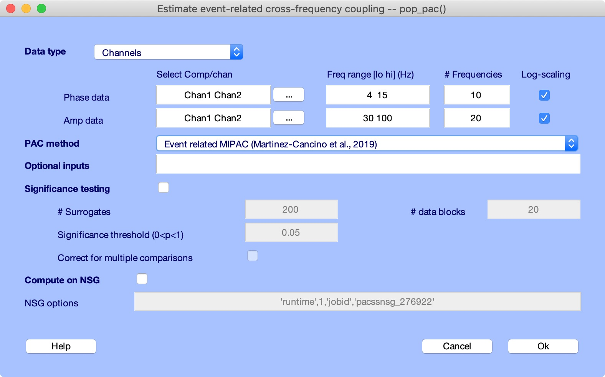
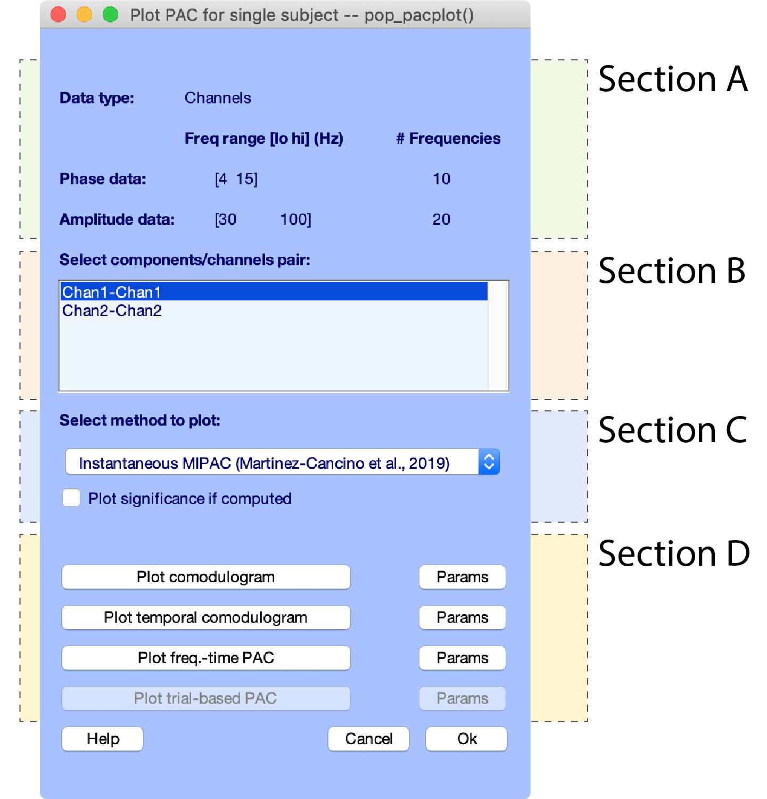
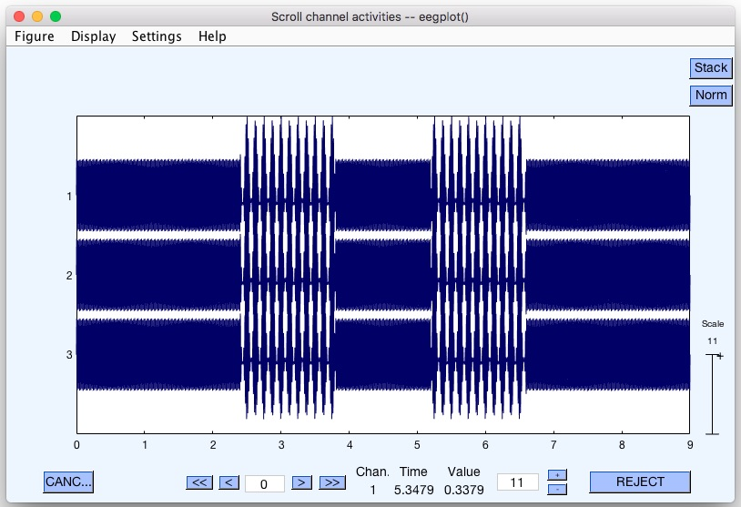
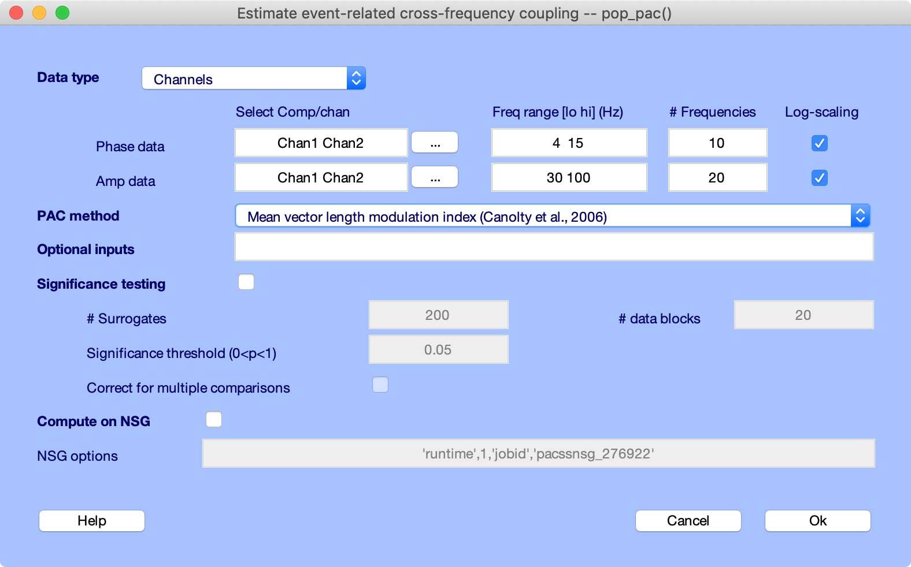
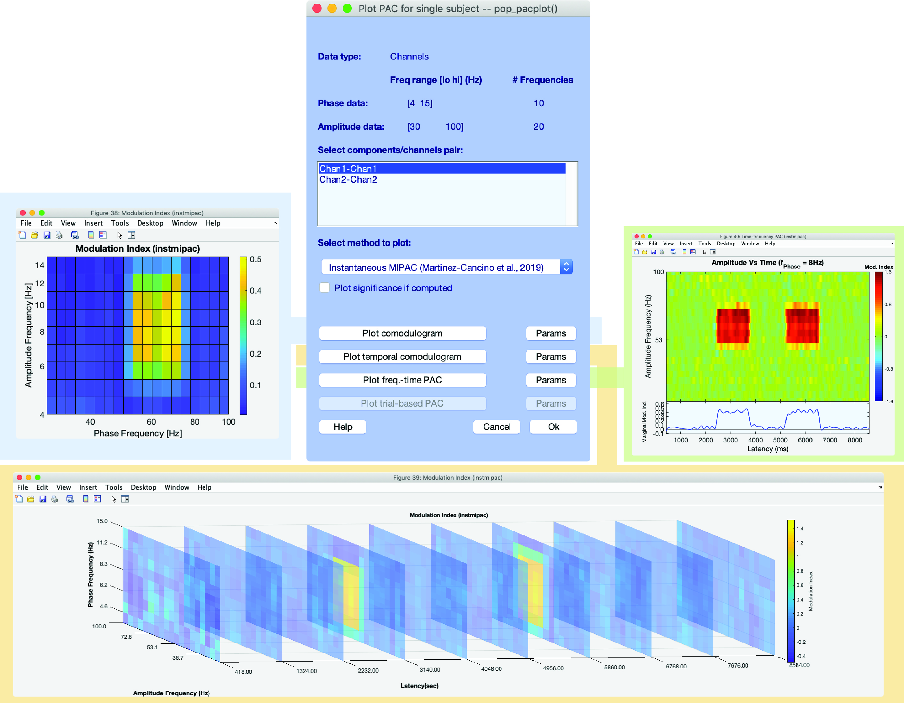

# EEGLAB Event Related PACTools
The Event Related PACTools (PACTools) is an EEGLAB plug-in to compute phase-amplitude coupling in single subject data. 
In addition to traditional methods to compute PAC, the plugin include the Instantaneuous and Event-Related implementation of the Mutual Information Phase-Amplitude Coupling Method (MIPAC) (see Martinez-Cancino et al 2019).
The toolbox is developed and maintained by the EEGLAB Team at the Swartz Center for Computational Neurosciences in UCSD, La Jolla, California.

## Table of Contents
1. [Phase-amplitude coupling in neurosciences](#phase-amplitude-coupling-in-neurosciences)
2. [Methods implemented in the toolbox](#methods-implemented-in-the-toolbox)
   1. [Continuous signal](#continuous-signal)
   2. [Epoched signal](#epoched-signal)
3. [Plugin architecture and workflow](#plugin-architecture-and-workflow)
	1. [Plugin architecture]([#plugin-architecture])
	2. [Plug-in setup](#plug-in-setup)
	3. [Graphical user interface](#graphical-user-interface)
	   1. [Computing PAC with pop_pac](#computing-pac-with-pop_pac)
	   2. [Visualizing PAC with pop_plotpac](#visualizing-pac-with-pop_plotpac)
	4. [Structure of outputs](#structure-of-outputs)  
4. [Demos](#demos)
   1. [Computing Mean Vector Length Modulation Index in a continuous signal](#computing-mean-vector-length-modulation-index-in-a-continuous-signal)
      1. [Computation](#computation)
      2. [Visualization](#visualization)
   2. [Computing Instantaneous MIPAC in a continuous signal](#computing-instantaneous-mipac-in-a-continuous-signal)
      1. [Computation](#computation)
      2. [Visualization](#visualization)
5. [Contributions and feedback](#contributions-and-feedback)

## Phase Amplitude Coupling in Neuroscience 
Cross-frequency coupling (CFC) could refer to any possible interaction between frequencies, phases, and amplitudes of oscillatory phenomena (*Sotero, 2016*). Most experimental work in this field has focused on three types of CFC: amplitude-amplitude coupling (AAC) or comodulation, phase-phase coupling (PPC) including bicoherence, and phase-amplitude coupling (PAC). Among them, PAC has attracted increasing interest given the growing amount of evidence of its potential role in brain information processing and its changes under pathological conditions, including epilepsy (*López-Azcárate et al., 2010; De Hemptinne et al., 2013*). In PAC, the instantaneous amplitude of a higher frequency band within a signal is modulated by (or otherwise linked to) the instantaneous phase of a lower-frequency band of the same (or a different) signal.


## Methods Implemented in the Toolbox
 Several methods have been proposed to address the computation of measures of  Phase-Amplitude coupling, but none has been established as a gold standard. This fact explains to some extent why most of the major academic open-source programs for analyzing electroencephalographic data has implemented more than one method in its distribution (e.g., Fieldtrip, Brainstorm, MNE). This is not different in EEGLAB with PACTools. In PACTools we have implemented four of the most widely used measures: The Mean Vector Length Modulation Index (MVLmi) (*Canolty et al., 2006*), the Kullback-Leibler Modulation Index (KLmi) (*Tort et al., 2010*), the Phase-Locking Value (plv) (*Lachaux et al., 1999*), and the General Linear Model Modulation Index (GLMmi) (*Penny et al., 2008a*).  The implementation of these ensures they can operate either in continuous and epoched signals. In the case of epoched signals, we use a scheme similar to the one proposed by *Voytek et al., 2013* with the use of the method by (*Penny et al., 2008*) in the dimension of the trials (assuming a data matrix of dimensions equal to the number of trials by latencies). In addition to these measures, we have included the  Mutual Information Phase Amplitude Coupling (MIPAC) (*Martinez-Cancino et al., 2019*)  developed recently by our group. This method allows naturally for the computation of time-resolved PAC in both continuous and epoched data.

## Continuous signal
In the table below are listed the methods implemented to compute PAC in continuous signals. References to the specific methods are listed in the second row of the table. A note on the dimension of the PAC values has been indicated in the third row of the table. 

| Method                                | Reference                                                                              | Output Dimension | 
| ---------                             | -----------                                                                            | --------------   | 
| Mean Vector Length Modulation Index   | [Canolty et al., 2006](https://www.ncbi.nlm.nih.gov/pmc/articles/PMC2628289/)          | Single value     |
| Kullback-Leibler Modulation Index     | [Tort et al., 2010](https://www.ncbi.nlm.nih.gov/pmc/articles/PMC2941206/)             | Single value     |
| General Linear Model Modulation Index | [Penny et al., 2008](https://www.ncbi.nlm.nih.gov/pmc/articles/PMC2675174/)            | Single value     |
| Phase Locking Value                   | [Lachaux et al., 1999](https://www.ncbi.nlm.nih.gov/pubmed/10619414)                   | Single value     |
| Instantaneous Mutual Information PAC  | [Martinez-Cancino et al., 2019](https://www.ncbi.nlm.nih.gov/pubmed/30342235)          | Unidimensional   |


### Epoched signal
In the table below are listed the current methods implemented in the toolbox to estimate PAC in epoched data. Epoched data is usually the result of extracting snippets of signals time-locked to an event(s) of interest. Here epoched data is assumed as being formated as a data matrix with dimensions of number of epochs(trials) by number of latencies(timepoints).  The first four methods listed in the table are a natural extension of the methods listed in the previous section but applying them onto each latency along the dimension of the epochs. The first application of this scheme was proposed by *Voytek et al., 2013* as an extension of the method by *Penny et al., 2008*. These methods return a time series describing the *'average'* PAC dynamics across all trials. For this type of data, the Event-related MIPAC method returns a PAC time series for each trial provided.

| Method                                | Reference                                                                             | Output Dimension |
| ---------                             | -----------                                                                           | --------------   | 
| Mean Vector Length Modulation Index   | [Canolty et al., 2006](https://www.ncbi.nlm.nih.gov/pmc/articles/PMC2628289/)         | Unidimensional   |
| Kullback-Leibler Modulation Index     | [Tort et al., 2010](https://www.ncbi.nlm.nih.gov/pmc/articles/PMC2941206/)            | Unidimensional   |
| General Linear Model Modulation Index | [Voytek et al., 2013](https://www.ncbi.nlm.nih.gov/pmc/articles/PMC2675174/)          | Unidimensional   |
| Phase Locking Value                   | [Lachaux et al., 1999](https://www.ncbi.nlm.nih.gov/pubmed/10619414)                  | Unidimensional   |
| Event-Related Mutual Information PAC  | [Martinez-Cancino et al., 2019](https://www.ncbi.nlm.nih.gov/pubmed/30342235)         | Bidimensional    |


# Plugin Architecture and Workflow
### Plugin architecture
The plugin PACTools is developed as an EEGLAB plugin. Given this, it shares the same philosophy regarding the structure and hierarchy of the functions as well as data formats(.set) as EEGLAB. In PACTools, depending on their level of Matlab expertise, users can either interact only with the graphics interface (GUI), else they can call functions directly from the Matlab command line or write their own Matlab scripts using EEGLAB functions and structures. This arrangement defines the hierarchy implemented by the two-level functions used in PACTools. 
 
 PACTools comprises two top-level functions implemented to compute and visualize PAC respectively: pop_pac and pop_plotpac Called with no (or few) arguments (as from the EEGLAB GUI), these functions pops up a query window to gather additional parameter choices. These functions can also be called directly from the Matlab command line or from Matlab scripts. 
 
The function pop_pac.m  provides the front-end interface for the toolbox it also serves as the bridge to the inner layer function, eeg\_pac.m. The function eeg\_pac.m is,  indeed, the core function of the PAC computation and is responsible for processing and parsing the input data and options in order to distribute it to the functions in charge of the computation of each of the PAC methods mentioned in the section [Methods Implemented in the Toolbox](#methods-implemented-in-the-toolbox).

**Code acceleration**. Computation of PAC can be a highly computationally intensive task. This is especially true when dealing with multiple frequencies for phases and amplitudes.  To add to the workload, the computation when using epoched data (multiples trials) makes the computation even more demanding. To speed up the PAC computation in PACTool we have parallelized the code using the MATLAB Parallel Computing Toolbox. Direct access to High-performance computing through the Neurosciences Gateways (NSG) has also been implemented. By using this option, users with a valid account in NSG can submit their PAC computation to the HPC resources hosted at NSG directly from within PACTools. To take advantage of this new feature in addition of having a valid NSG account, the user needs to install the EEGLAB plug-in [nsgportal](https://github.com/sccn/nsgportal)

### Plug-in setup
PACTools is a plugin to EEGLAB. Thus, its installation can be done directly from the EEGLAB plug-in manager (In the EEGLAB GUI see: File -> Manage EEGLAB extensions).
An alternative way is by downloading PACTools files to the user's local computer. Then, copying the folder with all the files to the EEGLAB folder located in *../eeglab/plugins/* and then restart EEGLAB. The toolbox can be located under the menu *Tools* in EEGLAB (see figure below).
<center>

</center>

### Graphical user interface
In its current version, the toolbox provide basic function to compute and visualize PAC that can be executed either from command line calls or from graphical user interfaces (GUI) created for these ends. Acces to GUI can be done from the EEGLAB GUI through *Tools >  PAC Tools*. Here we will be given the option to *Estimate PAC* or *Visualize PAC*. 

#### Computing PAC with pop_pac 
To invoke the GUI to compute PAC from the EEGLAB  GUI, click the menu *Tools >  PAC Tools > Estimate PAC*, otherwise, you can launch the GUI from the MATLAB command windows by typing `EEG = pop_pac(EEG)` (see figure below). Here we assume that the user has already loaded the EEG set where the PAC wants to be computed on.  
    
<center>

<end>
</center>    
    
The GUI is divided into five parts designated by the labels: **Data type**, **PAC Method**, **Optional inputs**, **Significance testing** and  **Compute on NSG** .
In the first section (**Data type**), the type of data used for PAC computation can be chosen between channel data (*Channels*) or ICA decomposed data (*Components*). 
Right below,  fields to input options associated with **Phase data**  and **Amplitude data**  can be used to define the data stream and the frequency band properties. For example,  In the first column, depending on the selection set in the **Data type** menu, the user can select the channels or components to compute PAC from a list of current channels or components under **Select Comp/chan**. Here, computation of PAC is done by channels/components pairs picked from **Phase data**  and **Amplitude data** menu, thus the same number of channels/components must be selected for in both fields.

In the second column (**Freq range [lo hi] (Hz)**), the range of frequencies (in Hz) to compute the instantaneous phase and amplitude can be defined. The number of frequencies in these ranges can be defined in the fourth column (**# Frequencies**). Two checkboxes to set the frequency scale,*logarithmic* when checked and *linear* when unchecked, can be found in the last column. By default a log scaling is set. Notice that currently, scaling of the frequency values is applied to both Phase and Amplitude values (checkboxes selection are linked).

The next two sections allow for the selection of the PAC method (**PAC Method**) and the input of pop_pac optional parameters at **Optional inputs**.  To list po_pac optional parameters refer to pop_pac.m help in the lowest left button **Help**.

The following section comprises the settings for the computation of PAC statistics (**Significance testing**). Here the number of surrogates (**# surrogates**), number of blocks to use to shuffle the data for generating the surrogates (**# data blocks**), the significance threshold (**Significance threshold (0<p<1)**) and multiple comparison correction (**Correct for multiple comparisons**) can bet set. 
 
The last section of pop_pac GUI, designated with the label **Compute on NSG** and enabled with a checkbox,  is reserved for enabling and setting the computation of PAC through the Neurosciences Gateway. We will expand on this capability in the next sections.

Finally, three buttons lay at the bottom of the GUI designated to launch the help documentation (button: **Help**), cancel the execution of the GUI without further action (button: **Cancel**) and to start the execution of PAC computation with the settings provided (button: **OK**).

#### Visualizing PAC with pop_plotpac
 Once PAC is computed using *pop_pac.m*, the results are stored in the EEG structure (see details in the next section). Visualization of the results can be done by invoking the function *pop_plotpac* from the command line (`pop_plotpac(EEG)`)or from the EEGLAB menu as *Tools >  PAC Tools > Visualize PAC* (see figure below).  
<center>

<end>
</center>    
The GUI of poc_pacplot comprises four major sections(depicted in the figure above).
Section A : In this section the user can get a quick glimpse of the parameters used for the computation of PAC stored in the current EEG set.
Section B: Display all the channel/components pairs for which PAC has been computed. The first element of the pair corresponds to the stream used to compute the instantaneous Phase, while the second element corresponds to the one used for the instantaneous Amplitude.

Section C: Here the methods used to compute PAC on the selected data stream pairs are shown. Users must select the measure they desire to plot. The checkbox enables the plotting of a significance mask over the PAC results if computed previously (currently only available for Comodulograms).

Section D: PAC results can be plotted from this section.  The four buttons on the right side of the interface correspond to the four types of plots that can be generated from pop_pacplot. These are:
 (1)*Plot comodulogram*: Plot PAC values as a function of phase and amplitude frequencies. Available for all methods and data formats.
(2)*Plot temporal comodulogram*: Plot PAC values as a function of phase frequencies, amplitude frequencies and latencies (time). This plot is available for continuous data if Instantaneous MIPAC has been computed. For event-related epoched data this plot is available for all the implemented methods.
(3)*Plot freq-time PAC*: Plot PAC values as a function of phase frequencies (or amplitude frequencies) and latencies (time). This plot is available for continuous data if Instantaneous MIPAC has been computed. For event-related epoched data this plot is available for all the implemented methods.
(4)*Plot trial-based PAC*: PLot PAC values for each trial as a function of time. Only enabled for  PAC computed using Event-Related MIPAC.

Based on PAC previously computed,  and the selection of the method computed, the plotting buttons will be enabled/disabled automatically. To the right side of each of the plotting buttons,  the user can define parameters like frequency and latency ranges specific to each plot on the left side.

### Structure of outputs
When PAC is computed with pop\_pac.m,  the results of the computation are stored in the field *EEG.etc.pac.eegpac* structure. In the code sample below it is shown a generic structure storing the PACs values computed for two pairs of channels using the General Linear Model (*glm*), Instantaneous MIPAC (*instmipac*), Kullback-Leibler Modulation Index  (*klmi*) and Mean Vector Length Modulation Index (*mvlmi*).
 
```matlab
>> EEG.etc.eegpac

  1×2 struct array with fields:

    dataindx
    datatype
    labels
    params
    cache
    glm
    instmipac
    klmi
    mvlmi

```
Diving into one of the structures corresponding to one of the pairs computed reveals more information related to the PAC computation.

```matlab
>> EEG.etc.eegpac(1)

  struct with fields:

     dataindx: [1 1]
     datatype: 1
       labels: {'Chan1-Chan1'}
       params: [1×1 struct]
        cache: [1×1 struct]
          glm: [1×1 struct]
    instmipac: [1×1 struct]
         klmi: [1×1 struct]
        mvlmi: [1×1 struct]
```

The last four fields here indicate that the measure computed.  These fields take the shortname given to the method used for the computation. In practice, we may find as many fields like this as PAC measures computed. These fields, in general, store the PAC values, the dimension of the output, and results specific to the method computed. The field *dataindx* contains the index of the components or channel used to extract the phase and amplitude respectively in order to compute PAC. The labels of these data streams are stored in the field *label*. The field *datatype* indicates the type of data used to compute PAC, ICA decomposed (0), or Channel data(1). 
The set of parameters common to all the methods computed, as phase-frequency (*freqs_phase*) and amplitude-frequency (*freqs_amp*) are stored in the field *params*. Below it is shown a sample parameter structure from the same *EEG.ect.eegpac* structure showed above.
 
```matlab
>> >> EEG.etc.eegpac(1).params

  struct with fields:

    freqs_phase: [4 4.6328 5.3657 6.2145 7.1976 8.3362 9.6549 11.1822 12.9512 15]
      freqs_amp: [30.0000 31.9625 34.0535 36.2812 38.6546 41.1833 43.8774 46.7478 49.8059 53.0641 56.5354 60.2338 64.1742 68.3723 72.8451 77.6105 82.6876 88.0968 93.8599 100.0000]
         signif: [1×1 struct]
          srate: 500
```
         
Finally, the field *cache* stores the serialized(encoded) parameters used for the current PAC computation. This field allows for a fast comparison with the parameters provided in a new computation and prevents the user to recompute and already computed PAC measure.
#### Method-specific fields
(work in progress..)

## Demo
### Computing Instantaneous MIPAC and MVLMI in a continuous signal

#### Computation

In this demo, we show how to compute PAC using *pop_pac* GUI and command-line call. For this, we first load the sample dataset provided with the toolbox, *Simpac\_famp\_60\_fphs\_8.set*, into EEGLAB. The dataset can be loaded either from the EEGLAB GUI or from the command windows by using the following code: 

```matlab
EEG = pop_loadset('filename','Simpac_famp_60_fphs_8.set');
eeglab redraw; 
```

Note: In this sample code, we assume the current directory to be the folder containing the toolbox.

This dataset contains a simulated PAC signal where the instantaneous phase at 8Hz and the instantaneous amplitude at 60Hz are coupled during two segments of the signal (see figure below).

<center>

</center>

After loading the dataset, we proceed to compute PAC with PACTools by using *pop_pac* GUI. To launch the GUI, select *Tools >  PAC Tools > Estimate PAC*  in the main EEGLAB GUI. Alternatively, you can use `EEG = pop_pac(EEG)` from the MATLAB command windows. Here we compute PAC using the Mean Vector Length Modulation Index method (*mvlmi*)  between 10 phase frequencies in the range [4 15]Hz and 20 amplitude frequencies in the range [30 100]Hz. To perform this computation, set *pop_pac* GUI as shown in the figure below, and click **Ok**.

<center>

<end>
</center>    

The equivalent command line call to perform this computation can be retreived with the command `eegh`. In this case will return in it last entry:

`EEG = pop_pac(EEG,'Channels',[4  15],[30  90],[1 2],[1 2],'method','mvlmi','nboot',200,'alpha',[],'nfreqs1',10,'nfreqs2',20,'freqscale','log','bonfcorr',0);`

To compute PAC with the same settings for an additional measure, we call *pop_pac* GUI again and select the new method after setting up the same set of parameters used for the previous computation. The results from the new computation will be saved in the EEG structure, following the specifications in the sections above. If the user sets different parameters from the ones saved from the previous computation, *pop_pac* delete the old computation and proceed with the new one. In this example, we compute PAC using the same parameters used above but using Instantaneous MIPAC (*instmipac*):

`EEG = pop_pac(EEG,'Channels',[4  15],[30  90],[1 2],[1 2],'method','instmipac','nboot',200,'alpha',[],'nfreqs1',10,'nfreqs2',20,'freqscale','log','bonfcorr',0);`

A quick look into the results yield the following structure of results:

```matlab
>> EEG.etc.eegpac(1)

  struct with fields:

     dataindx: [1 1]
     datatype: 1
       labels: {'Chan1-Chan1'}
       params: [1×1 struct]
        cache: [1×1 struct]
    instmipac: [1×1 struct]
        mvlmi: [1×1 struct]
```

and 

```matlab
>> EEG.etc.eegpac(1)

  struct with fields:

     dataindx: [2 2]
     datatype: 1
       labels: {'Chan2-Chan2'}
       params: [1×1 struct]
        cache: [1×1 struct]
    instmipac: [1×1 struct]
        mvlmi: [1×1 struct]
```

#### Visualization
To visualize the PAC values computed previously we use the *pop_plotpac* GUI (click *Tools >  PAC Tools > Visualize PAC*). From the  *pop_plotpac* GUI we select the channel pair and the measure to visualize, then proceed to plot PAC results using the enabled plots in section D of the GUI. The figure below shows the plots generated for the Instantaneous MIPAC (*instmipac*) from each of the plotting options available for this measure: *Comodulogram*, *Temporal comodulogram* and *Freq.-time PAC*. We used default plotting options here, but users are encouraged to explore how the different plotting parameter options modify the visualization.

<center>

<end>
</center>    

### Contributions and feedback
This is an open-source project on constant development. Please, contact the authors at ram033@eng.ucsd.edu for contributions. The use of the issue tracker is encouraged. 
