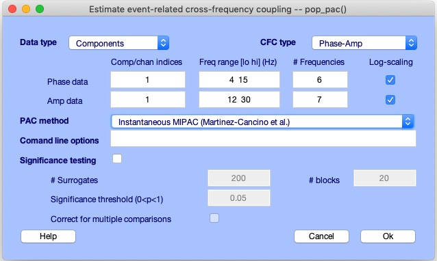
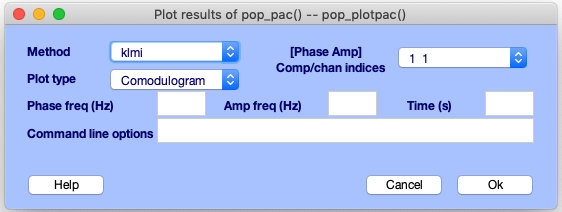
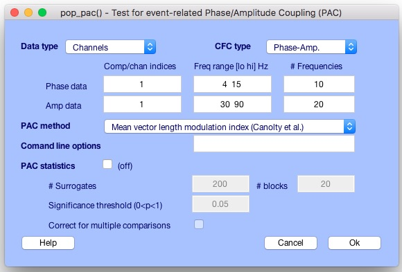
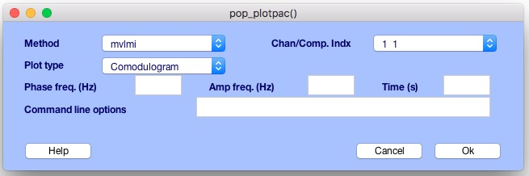
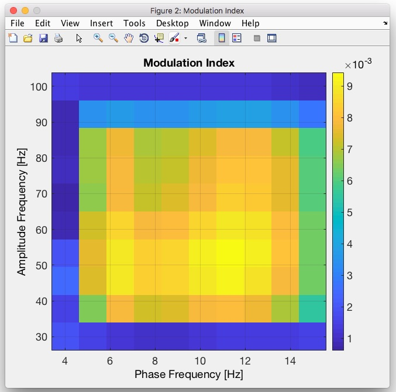
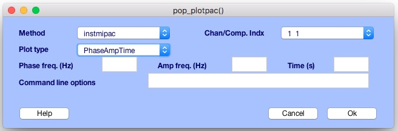
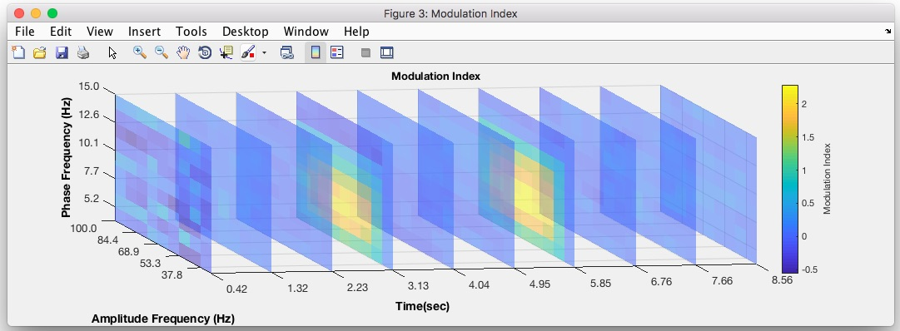

# EEGLAB Event Related PAC Tools
The Event Related PAC Tools (PAC Tools) is an EEGLAB plug-in to compute phase-amplitude coupling. 
While the plug-in is still in its early development, usage and feedback is encouraged.
In addition to traditional methods to compute PAC, the plugin include the Instantaneuous and Event-Related implementation of the Mutual Information Phase-Amplitude Coupling Method (MIPAC) (see Martinez-Cancino et al 2019).
The toolbox is developed and maintained at the Swartz Center for Computational Neurosciences, UCSD, La Jolla, California.

## Table of Contents
1. [Phase-amplitude coupling in neurosciences](#phase-amplitude-coupling-in-neurosciences)
2. [Methods implemented in the toolbox](#methods-implemented-in-the-toolbox)
   1. [Continuous signal](#continuous-signal)
   2. [Epoched signal](#epoched-signal)
3. [Plugin architecture and workflow](#plugin-architecture-and-workflow)
	1. [Plugin architecture]([#plugin-architecture])
	2. [Plug-in setup](#plug-in-setup)
	3. [Graphical user interface](#graphical-user-interface)
	   1. [Computing PAC with pop_pac](#computing-pac-with-pop_pac)
	   2. [Visualizing PAC with pop_plotpac](#visualizing-pac-with-pop_plotpac)
	4. [Structure of outputs](#structure-of-outputs)  
4. [Demos](#demos)
   1. [Computing Mean Vector Length Modulation Index in a continuous signal](#computing-mean-vector-length-modulation-index-in-a-continuous-signal)
      1. [Computation](#computation)
      2. [Visualization](#visualization)
   2. [Computing Instantaneous MIPAC in a continuous signal](#computing-instantaneous-mipac-in-a-continuous-signal)
      1. [Computation](#computation)
      2. [Visualization](#visualization)
5. [Contributions and feedback](#contributions-and-feedback)

## Phase Amplitude Coupling in Neuroscience 
Cross-frequency coupling (CFC) could refer to any possible interaction between frequencies, phases and amplitudes of oscillatory phenomena (*Sotero, 2016*), most experimental work has focused on three types of CFC: amplitude-amplitude coupling (AAC) or comodulation, phase-phase coupling (PPC) including bicoherence, and phase-amplitude coupling (PAC). Among them, PAC has attracted increasing interest given the growing amount of evidence of its potential role in brain information processing and its changes under pathological conditions including epilepsy (*López-Azcárate et al., 2010; De Hemptinne et al., 2013*). In PAC, the instantaneous amplitude of a higher frequency band within a signal is modulated by (or otherwise linked to) the instantaneous phase of a lower-frequency band of the same (or a different) signal.

## Methods Implemented in the Toolbox
Several methods have been proposed to measure PAC. However, none is currently a gold standard.  In this toolbox, in addition to the recently developed Mutual Information Phase Amplitude Coupling (MIPAC) (*Martinez-Cancino et al., 2019*) , we have currently implemented three of the measures most often cited in the PAC literature: the Mean Vector Length Modulation Index (MVLmi) (*Canolty et al., 2006*), the Kullback-Leibler Modulation Index (KLmi) (*Tort et al., 2010*), and the General Linear Model Modulation Index (GLMmi) (*Penny et al., 2008a*). These measures have the ability to operate either in continues and epoched signals. In the case of epoched signals, a scheme similar to the one proposed by *Voytek et al., 2013* with the use of the method by (*Penny et al., 2008*) in the dimension of the trials (assuming a data matrix of dimensions equal to number of trials by latencies) is implemented.
 

### Continuous signal
In the table below are listed the methods implemented to compute PAC in continuous signals. References to the specific methods are listed in the second rowof the table. The dimension of the output of the PAC methods  is indiceted in the third row of the table. 


Most of the PAC methods in the literature return a single value of the PAC measure for a given single trial signal (two single trials signals corresponding to different frequency bands of interest can be assumed as well). In the case of Instantaneous MIPAC, though, the result is provided as a unidimensional time series describing the PAC dynamics in the input signal(s). 

| Method                                | Reference                                                                              | Output Dimension | 
| ---------                             | -----------                                                                            | --------------   | 
| Mean Vector Length Modulation Index   | [Canolty et al., 2006](https://www.ncbi.nlm.nih.gov/pmc/articles/PMC2628289/)          | Single value     |
| Kullback-Leibler Modulation Index     | [Tort et al., 2010](https://www.ncbi.nlm.nih.gov/pmc/articles/PMC2941206/)             | Single value     |
| General Linear Model Modulation Index | [Penny et al., 2008](https://www.ncbi.nlm.nih.gov/pmc/articles/PMC2675174/)            | Single value     |
| Phase Locking Value                   | [Lachaux et al., 1999](https://www.ncbi.nlm.nih.gov/pubmed/10619414)                   | Single value     |
| Instantaneous Mutual Information PAC  | [Martinez-Cancino et al., 2019](https://www.ncbi.nlm.nih.gov/pubmed/30342235)          | Unidimensional   |

### Epoched signal
In the table below are listed the current methods implemented in the toolbox to estimate PAC in epoched data. Epoched data is usually the result of extracting snipets of signals time-locked to an event(s) of interest. Here epoched data is assumed as being formated as a data matrix with dimensions of number of epochs(trials) by number of latencies(timepoints).  The four first methods listed in the table are a natural extension of the methods listed in the previous seccion but applying them onto each latency along the dimension of the epochs. The fisrt application of this scheme was proposed by *Voytek et al., 2013* as an extension of the method by Penny et al., 2008. These methods return a PAC time series describing the 'average' dynamics of the procces in the trials. Event-related MIPAC method, though, return a PAC time series for each trial provided.

| Method                                | Reference                                                                             | Output Dimension |
| ---------                             | -----------                                                                           | --------------   | 
| Mean Vector Length Modulation Index   | [Canolty et al., 2006](https://www.ncbi.nlm.nih.gov/pmc/articles/PMC2628289/)         | Unidimensional   |
| Kullback-Leibler Modulation Index     | [Tort et al., 2010](https://www.ncbi.nlm.nih.gov/pmc/articles/PMC2941206/)            | Unidimensional   |
| General Linear Model Modulation Index | [Voytek et al., 2013](https://www.ncbi.nlm.nih.gov/pmc/articles/PMC2675174/)          | Unidimensional   |
| Phase Locking Value                   | [Lachaux et al., 1999](https://www.ncbi.nlm.nih.gov/pubmed/10619414)                  | Unidimensional   |
| Event-Related Mutual Information PAC  | [Martinez-Cancino et al., 2019](https://www.ncbi.nlm.nih.gov/pubmed/30342235)         | Bidimensional    |


## Plugin Architecture and Workflow
### Plugin architecture
The plugin PAC Tools is developed as an EEGLAB plugin. Given this, it shares the same philosophy regarding the functions structure and hierarchy as well as data formats(.set) as EEGLAB. Functions in EEGLAB are designed to provide users, both novice and expert Matlab users, with an easy and flexible usage. Depending on their level of Matlab expertise, users can either interact only with the graphics interface (GUI), else they can call functions directly from the Matlab command line or write their own Matlab scripts using EEGLAB functions and structures. This arrangement defines the hierarchy implemented by the two-level functions used in PAC Tools. 
 
 Specifically in the plugin, the top layer function pop_pac.m provides its own GUI. Called with no (or few) arguments (as from the EEGLAB GUI), this function pops up a query window to gather additional parameter choices. The pop\_pac.m function can also be called directly from the Matlab command line or from Matlab scripts. 
 
As the top-layer function, pop_pac.m  provides the front-end interface for the toolbox it also serves as the bridge to the inner layer function, eeg\_pac.m. Users with a high level of Matlab/EEGLAB expertise can call this function directly by providing all the inputs required. The function eeg\_pac.m is indeed, the core function of the toolbox and is responsible for processing and parsing the input data and options in order to distribute it to the functions in charge of the computation of each of the PAC methods mentioned in the section [Methods Implemented in the Toolbox](#methods-implemented-in-the-toolbox).

### Plug-in setup
To setup PAC Tools, copy the *pop_pac* folder to the EEGLAB folder located in *../eeglab/plugins/* and then restart EEGLAB. Once a dataset is loaded, the toolbox can be located under the menu *Tools* in EEGLAB (see figure below).
<center>

</center>

### Graphical user interface
In its current version, the toolbox provide basic function to compute and visualize PAC that can be executed either from command line calls or from graphical user interfaces (GUI) created for these ends. The GUI can be invoked from the mEEGLAB menu *Tools >  PAC Tools*. Here we will be given the option to *Estimate PAC* or *Visualize PAC*. In the following subsections we explain each of these two options.

#### Computing PAC with pop_pac 
To invoke the GUI to compute PAC from the EEGLAB  GUI, click the menu *Tools >  PAC Tools > Estimate PAC*, otherwise you can launch the gui from the command line by typing `EEG = pop_pac(EEG)`. The figure below shows the graphical user interface of the toolbox. 
	
<center>

<end>
</center>	
	
The GUI is divided in four parts designated by the labels: **Data type**/**CFC type**, **PAC method**, **Command line options** and **PAC statistics**.
In the first section (**Data type**/**CFC type**), the type of data used for PAC computation can be selected in **Data type** between channel data (*Channels*) or ICA decomposed data (*Components*). The label **CFC type** is currently a static text indicating the type of CFC computation performed. The rationale of keeping this in the GUI is that future releases of the toolbox may contain other CFC methods in addition to PAC.
Right in the next line, a set of edits are used to input the property values for **Phase data**  and **Amplitude data**. In the first column, the index of the channels/components to use to compute PAC are defined (**Comp/chan indices**). In the second column (**Freq range [lo hi] (Hz)**), the range of frequencies (in Hz) to compute the instantaneous phase and amplitude can be defined. The number of frequencies in these ranges can be defined in the fourth column (**# Frequencies**). Additional checkboxes  indicating the frequency scaling used can be found in the last column. By defaul a log scaling is set. Notice that currently, scaling of the frequency values is applied to both Phase and Amplitude values (checkboxes selection are linked).

The next two sections allow for the selection of the PAC method (**PAC Method**) and input of optional parameters at **Command line options**. 

The last section comprises the settings for the computation of PAC statistics (**Significance testing**). Here the number of surrogates (**# surrogates**), number of blocks to use to shuffle the data for generating the surrogates (**# blocks**), the significance threshold (**Significance threshold (0<p<1)**) and multiple comparison correction (**Correct for multiple comparisons**) can bet set. Three buttons lay at the bottom  of the GUI designated to launch the help documention (button: **Help**), cancel the execution of the GUI without further action (button: **Cancel**) and to start the execution of PAC computation with the settings provided (button: **OK**).

#### Visualizing PAC with pop_plotpac
 Once PAC is computed using *pop_pac.m*, the results are stored in the EEG structure (see details in the next section). Visualization of the results can be done by invoking the function *pop_plotpac* (which call *eeg_plotpac.*) from the command line (`pop_plotpac(EEG)`)or from the EEGLAB menu as *Tools >  PAC Tools > Visualize PAC* (see figure below). Notice that *pop_plotpac* is the function that gather all the inputs (if incomplete list of inputs are provided then pops the GUI) in order to pass the full list of inputs to *eeg_plotpac.*. The later one is the function that actually perform the plotting.
 
<center>

<end>
</center>	

To procceed to visualize the results with *pop_plotpac.*, start by selecting the method (**Method**) and the data stream indices (**[Phase Amp] Comp/chan indices**) used to compute in this case the instantaneous phase and amplitude needed to compute PAC (e.g., [1 2] means that phase was extracted from channel or component 1 and amplitude was computed from channel or component 2). Then proceed to select the type of plot you want to generate. Notice that at this point this list contain  all the list of plot available, and not the plots that can be generated from your computed PAC values (this option will be added in next releases). See below a list of the plots that can be generated according to the dimension of the PAC results.

**For 1D data results:** 

Available for: **klmi, glm, mvlmi** on single trial data. (Must have EEG.etc.eegpac.(methodname).dim = 1 **)

- 'Comodulogram': Standard comodulogram Phase Vs Amplitude

**For 3D data results (Phase-Amplitude-Time):** 

Available for: **instmipac** on sigle trials, and traditional methods (**klmi, glm, mvlmi**) on multiple trials data. (Must have EEG.etc.eegpac.(methodname).dim = 2 **) 

- 'PhaseAmpTime':  Tri-dimensional plot of Phase Vs Amplitude Vs Time
- 'Amp-PhaseTime': Bi-dimensional plot of Phase Vs Time for a pinned Amplitude value
- 'Phase-AmpTime': Bi-dimensional plot of Amplitude Vs Time for a pinned Phase value
- 'Time-PhaseAmp': Bi-dimensional plot of Phase Vs Amp (comodulogram) for a pinned Time value.
 
**For 4D data results (Trials-Phase-Amplitude-Time,):**

Available for: currently only for **instmipac** (Must have EEG.etc.eegpac.(methodname).dim = 3 **) 

- 'AmpPhase-TrialTime': Trials Vs Time for pinned values of Aplitude and Phase
- 'Amp-PhaseTrialTime': Tridimensional plot Phase Vs Trials Vs Time for pinned value of Amplitude
- 'Phase-AmpTrialTime': Tridimensional plot Amplitude Vs Trials Vs Times for pinned Phase values 

If one of the options that required a pinned value is selected, then proceed to provide this/these value(s) in the edit boxes **Phase freq.(Hz)**, **Amp freq. (Hz)** and **Time (s)**. Additional options to *pop_plotpac.m* and *eeg_plotpac.m* can be provided in **Command line options** following the structure :'key name', 'key value'
. 
### Structure of outputs
 When computing PAC from pop\_pac.m,  the results of the computation are stored in the field *EEG.etc.pac.eegpac* structure. As an example, in the snippet below is shown a sample structure storing the computation of PAC using Instantaneous MIPAC (*instmipac*) and Kullback-Leibler Modulation Index methods.
 
```matlab
>> EEG.etc.eegpac(1)

  struct with fields:
  
     dataindx: [1 1]
     datatype: 1
       params: [1×1 struct]
    instmipac: [1×1 struct]
         klmi: [1×1 struct]
```

The last two fields here indicate that the measure computed was Instantaneous MIPAC (*instmipac*) and Kullaback-Leibler Modulation Index (*klmi*). These fields takes the name of the measure computed. In practice, we may find as many fields like this as PAC measures computed. This fields, in general, store the PAC values, the dimension of the output and results specific to the method computed. The field *dataindx*  contain the information of the components or channel used to extract the phase and amplitude  respectively in order to compute PAC. The type of data (ICA decomposed or Channel data) used to compute PAC can be found in the field *datatype*. Where *1* correspond to channel data and *2* to components.
The set of parameters common to all the methods computed, as phase frequency (*freqs_phase*) and amplitude frequency (* freqs_amp*) are stored in the field *params*. Below it is shown a sample parameter structure from the same *EEG.ect.eegpac* structure showed above.
 
```matlab
>> >> EEG.etc.eegpac(1).params

  struct with fields:

    freqs_phase: [4 6.2000 8.4000 10.6000 12.8000 15]
      freqs_amp: [30 41.6667 53.3333 65 76.6667 88.3333 100]
         signif: [1×1 struct]
          srate: 500
```
## Demos
### Computing Mean Vector Length Modulation Index in a continuous signal

#### Computation

In this demo we will show how to compute PAC from the GUI. For this, lets first load the sample dataset *Simpac\_famp\_60\_fphs\_8.set* into EEGLAB. The dataset can be loaded either from the EEGLAB GUI or from the command windows by using the following code: 

```matlab
EEG = pop_loadset('filename','Simpac_famp_60_fphs_8.set');
eeglab redraw; 
```

Note: In this snnipet code the current directory is assumed to be the folder containing the toolbox.

This dataset contains a simulated PAC signal where the instantaneous phase at 8Hz and the instantaneous amplitude at 60Hz are coupled during two segments of the signal, (see figure below).

<center>

</center>

After loading the dataset, we will proceed to compute PAC using PAC Tools from its main GUI. To launch the GUI, select *Tools >  PAC Tools > Estimate PAC*  in the main EEGLAB GUI. Alternatively you can use `EEG = pop_pac(EEG)` from the MATLAB command windows. Here we will compute PAC using the Mean Vecto length Modulation Index (*mvlmi*) between the phases in the range [4 15] Hz and the amplitudes  in the range [30 90]Hz. In these ranges, 10 and 20 frequencies will be used respectively. To perform the computation, enter the parameters in the *pop_pac* GUI as shown in the figure below and click **Ok**.

<center>

<end>
</center>	

The equivalent command to perform this computation can be retreived with the command `eegh`. In this case will return in it last entry:

`EEG = pop_pac(EEG,'Channels',[4  15],[30  90],[1],[1],'method','mvlmi','nboot',200,'alpha',[],'nfreqs1',10,'nfreqs2',20,'freqscale','linear','bonfcorr',0);`

#### Visualization
To visualize the modulation index computed previously, click on  *Tools >  PAC Tools > Visualize PAC*. The GUI for *pop_plotpac* will pop up.
Then select the options as in the figure below and click **OK**.

<center>

<end>
</center>	

After this, a figure showing a comodulogram will pop up.

<center>

<end>
</center>	

Note that this computation was performed to illustrate the procces of PAC computation and it did not envolved computation of statistical significance. In a real life situation, the computation of significance (which is allowed from PAC Tools) must be performed. 
### Computing Instantaneous MIPAC in a continuous signal
In this demo  we will compute MIPAC on a the same single trial data used in *Demo 1*.

#### Computation
To compute MIPAC in single trial signals, follow the same steps as in *Demo 1* to open the *pop_pac* GUI. Then enter the same parameters as in *Demo 1* but select *Instaneous MIPAC* from **PAC method**. Then click **OK**.
#### Visualization
Here we will visualize a 2D comodulogram with the evolution of PAC across time. For this, launch *pop_plotpac* from *Tools >  PAC Tools > Visualize PAC* and select the options to match the figure below.

<center>

<end>
</center>	

The figure below  will pop up.

<center>

<end>
</center>	

### Contributions and feedback
This is an open source project, however, since this is still in its Beta Version, please, contact the authors at ram033@eng.ucsd.edu for contributions. The use of the issue tracker is encouraged. 
